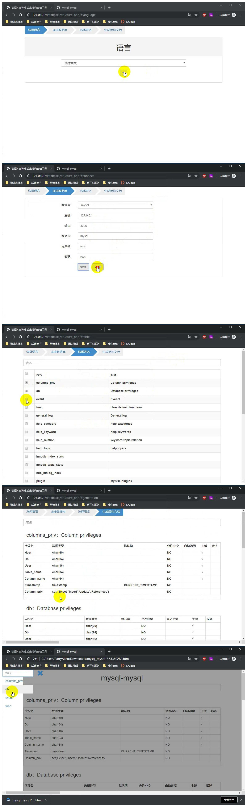

# database_structure

#### 介绍
数据库表结构生成工具

#### 文件树
###### database_structure
###### ├─database_structure_c#
###### ├─database_structure_java
###### └─database_structure_php

#### 效果图

#### 说明：
1. 这是一个数据库文档生成工具，根据数据库表结构反向生成单个html文件，可以在本地预览
2. 工具支持使用java，asp.net（c#），php编写支持二次开发，支持oracle，mysql，sqlserver，postgresql数据库
3. 使用和开发时请参考各个版本下面的README.md文件
4. 本代码开源免费，不需要作者授权使用，欢迎大家使用
5. 本项目发布后，不会更新本项目，如果出现问题请自行解决，或者使用下面的方式联系作者协助
6. 后续项目作品会在下面帐号中发布，同时发布到git上，喜欢作者的作品请关注我

#### 关注我：
- weibo：开发者_K ，twitter：dev_mr_k ，instagram：dev_mr_k，mail：864154654@qq.com
